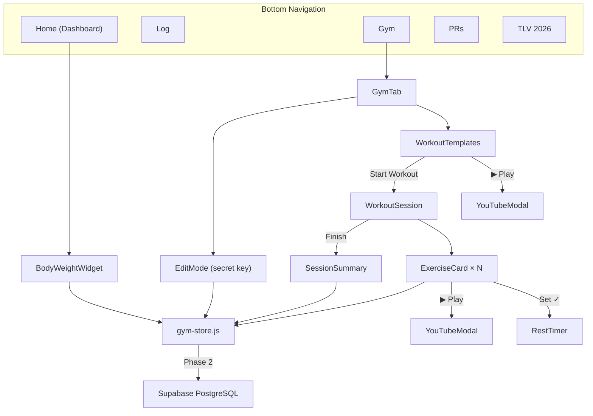
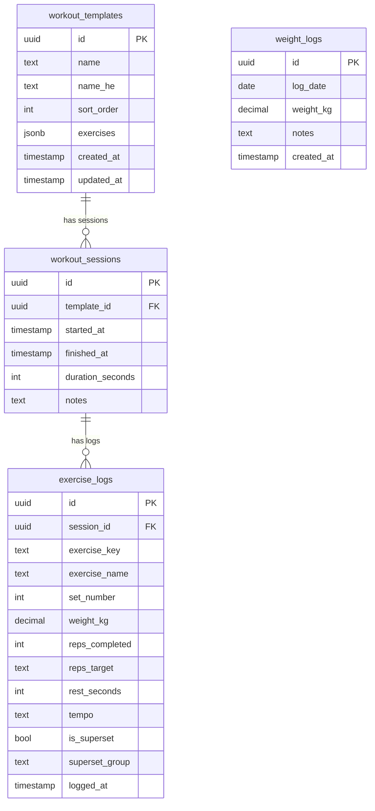
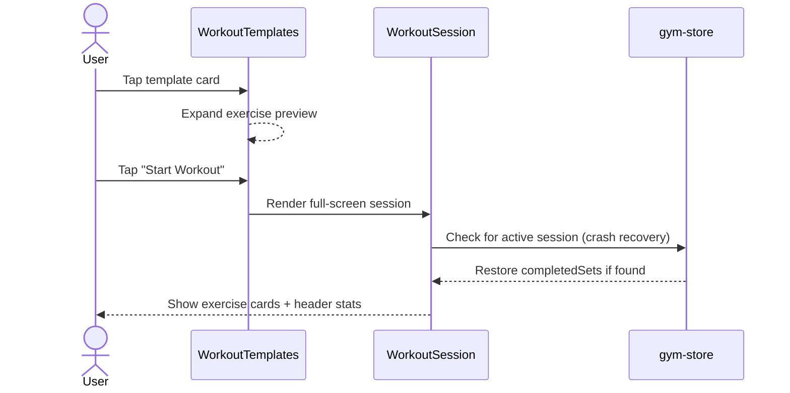
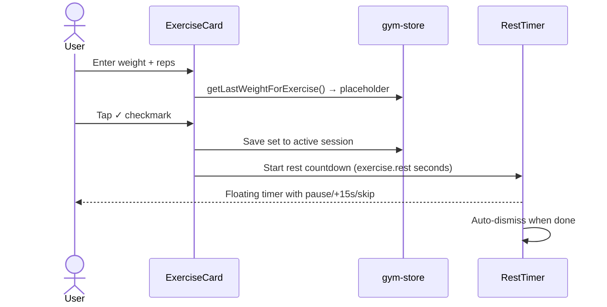
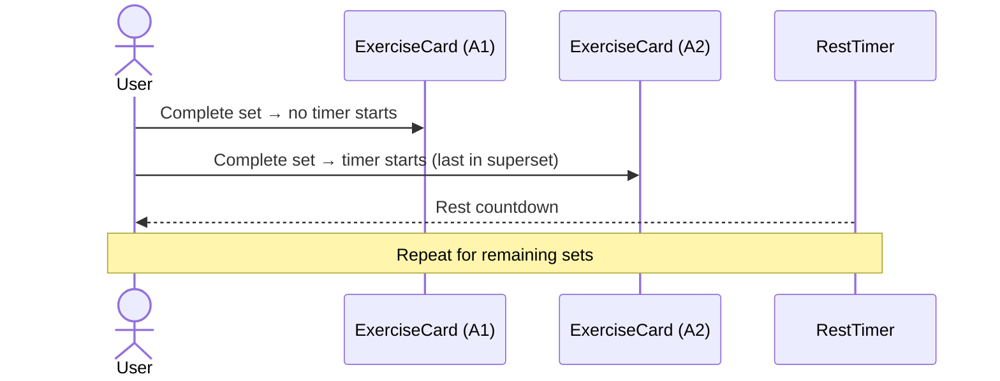
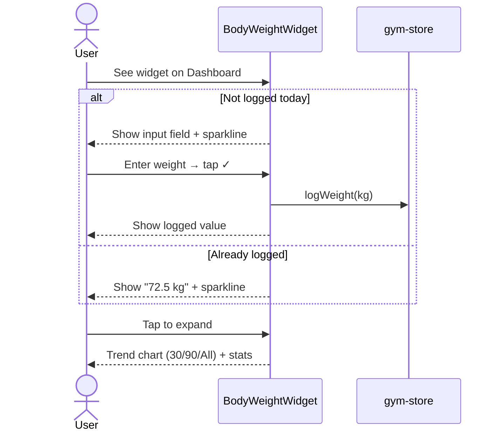
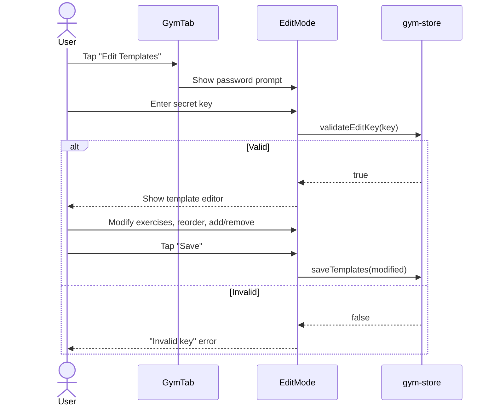

# Gym Tracker Feature

Strength workout tracker with workout templates, live session logging, progressive overload hints, and body weight tracking.

## Architecture



## Data Flow

1. **Templates** are defined in `lib/gym-data.js` as seed data (4 workout programs)
2. **gym-store.js** provides a unified API over `localStorage` with the same interface planned for Supabase
3. Components call store functions directly — no global state management needed
4. **Active session** state is auto-saved to `localStorage` so it persists if the browser is closed mid-workout

## Data Model

### Workout Templates (JSONB)

Each template contains an `exercises` array stored as structured JSON. This avoids schema changes when modifying exercise details.

```json
{
  "id": "push",
  "name": "Push",
  "name_he": "דחיפה",
  "color": "#F97316",
  "muscles": ["Chest", "Triceps", "Shoulders", "Quads"],
  "exercises": [
    {
      "key": "cable_tricep_kickback",
      "name": "פשיטת מרפק קיקבאק בפולי",
      "name_en": "Cable Tricep Kickback",
      "videoId": "okEf9-X_GvM",
      "sets": 3,
      "reps": "8-12",
      "rest": 60,
      "tempo": null,
      "superset": null
    }
  ]
}
```

### Database Schema (Phase 2)



### localStorage Schema (Phase 1)

| Key | Type | Description |
|-----|------|-------------|
| `gym_sessions` | `Session[]` | Completed workout sessions with exercise logs |
| `gym_templates` | `Template[]` | User-modified template overrides (falls back to seed data) |
| `gym_weights` | `{date, weightKg}[]` | Daily body weight entries, sorted newest-first |
| `gym_active_session` | `object` | In-progress workout state (auto-saved for crash recovery) |
| `gym_edit_key` | `boolean` | Whether edit mode is currently unlocked |

#### Session Shape

```json
{
  "id": "m1abc123",
  "templateId": "push",
  "templateName": "Push",
  "startedAt": "2026-04-05T08:30:00.000Z",
  "finishedAt": "2026-04-05T09:15:00.000Z",
  "durationSeconds": 2700,
  "exerciseLogs": [
    {
      "exerciseKey": "incline_db_press",
      "exerciseName": "לחיצת חזה עליון עם משקולות",
      "setNumber": 1,
      "weightKg": 30,
      "reps": 8,
      "completedAt": 1712345678000
    }
  ]
}
```

## User Flows

### Starting a Workout



### Logging a Set



### Superset Flow



### Body Weight Logging



### Edit Mode



## File Map

| File | Purpose | Key Exports |
|------|---------|-------------|
| `lib/gym-data.js` | Seed data for 4 workout templates | `WORKOUT_TEMPLATES` |
| `lib/gym-store.js` | localStorage abstraction (DB-ready interface) | `getTemplates`, `saveSession`, `getLastWeightForExercise`, `logWeight`, `getWeightStats`, ... |
| `src/components/GymTab.jsx` | Main Gym tab orchestrator | `GymTab` |
| `src/components/gym/WorkoutTemplates.jsx` | Template browser with expandable cards | `WorkoutTemplates` |
| `src/components/gym/WorkoutSession.jsx` | Active workout logging screen | `WorkoutSession` |
| `src/components/gym/ExerciseCard.jsx` | Single exercise with set input rows | `ExerciseCard` |
| `src/components/gym/RestTimer.jsx` | Floating countdown timer | `RestTimer` |
| `src/components/gym/YouTubeModal.jsx` | In-app YouTube video player modal | `YouTubeModal` |
| `src/components/gym/SessionSummary.jsx` | Post-workout summary overlay | `SessionSummary` |
| `src/components/gym/EditMode.jsx` | Secret-key-protected template editor | `EditMode` |
| `src/components/dashboard/BodyWeightWidget.jsx` | Dashboard weight card with sparkline | `BodyWeightWidget` |

## Design Decisions

### Why JSONB for exercises in templates?

Exercise definitions change frequently (add/remove exercises, adjust reps/rest/tempo). Storing them as JSONB inside the template row avoids database migrations for every tweak. The trade-off is that querying individual exercises requires JSON path queries, but we never need to query exercises independently of their template.

### Why `exercise_key` for weight tracking?

Exercise names are in Hebrew and may be edited. A stable `exercise_key` (e.g., `"incline_db_press"`) ensures that weight history persists even if the display name changes. When querying "what was my last weight for this exercise?", we match by `exercise_key`, not by name.

### Why localStorage first?

- Zero infrastructure cost and setup
- Instant reads/writes with no network latency
- Works offline (important during gym workouts with poor signal)
- The `gym-store.js` API is designed to be swapped to Supabase without changing any component code

### Superset grouping model

Exercises in a superset share a `superset` field value (e.g., `"A"`, `"B"`). The rest timer only triggers after the **last** exercise in the superset is completed, matching real-world superset flow where you alternate without rest, then rest after the full pair.

### YouTube exercise tutorials

Each exercise has a `videoId` field linking to a verified YouTube tutorial. Videos open in an embedded modal (`YouTubeModal`) inside the app rather than navigating to YouTube, so the user stays in context during a workout. Play buttons appear both in the template preview and during active sessions.

### Bilingual exercise names

Exercises have both `name` (Hebrew) and `name_en` (English) fields. English is displayed as the primary name for clarity; Hebrew appears below in smaller text for local context. This avoids ambiguity when exercise names are technical.

### Superset visual grouping

During an active session, exercises belonging to the same superset are wrapped in a purple-bordered container with a "Superset A/B/..." label badge. This makes it immediately clear which exercises should be performed back-to-back.

### Duration estimation

Template cards show estimated workout duration calculated from: 50s per set execution + prescribed rest between sets + 120s transition between exercises (15s for supersets). This accounts for real-world setup time, unlike naive calculations that only count set+rest.

### Body weight on Dashboard, not in Gym

Weight tracking is a daily ritual (log once in the morning) with minimal UI depth. Placing it as a compact widget on the Dashboard makes it instantly accessible as part of the "daily check-in" flow, while keeping the Gym tab focused purely on strength training sessions.

## Supabase Migration Guide (Phase 2)

### 1. Create Supabase project

Go to [supabase.com](https://supabase.com), create a project, and note your project URL and `anon` key.

### 2. Run SQL schema

```sql
CREATE TABLE workout_templates (
  id UUID PRIMARY KEY DEFAULT gen_random_uuid(),
  name TEXT NOT NULL,
  name_he TEXT,
  sort_order INTEGER DEFAULT 0,
  exercises JSONB NOT NULL DEFAULT '[]',
  created_at TIMESTAMPTZ DEFAULT now(),
  updated_at TIMESTAMPTZ DEFAULT now()
);

CREATE TABLE workout_sessions (
  id UUID PRIMARY KEY DEFAULT gen_random_uuid(),
  template_id UUID REFERENCES workout_templates(id),
  started_at TIMESTAMPTZ NOT NULL,
  finished_at TIMESTAMPTZ,
  duration_seconds INTEGER,
  notes TEXT,
  created_at TIMESTAMPTZ DEFAULT now()
);

CREATE TABLE exercise_logs (
  id UUID PRIMARY KEY DEFAULT gen_random_uuid(),
  session_id UUID REFERENCES workout_sessions(id) ON DELETE CASCADE,
  exercise_key TEXT NOT NULL,
  exercise_name TEXT,
  set_number INTEGER NOT NULL,
  weight_kg DECIMAL(6,2),
  reps_completed INTEGER,
  reps_target TEXT,
  rest_seconds INTEGER,
  tempo TEXT,
  is_superset BOOLEAN DEFAULT false,
  superset_group TEXT,
  logged_at TIMESTAMPTZ DEFAULT now()
);

CREATE TABLE weight_logs (
  id UUID PRIMARY KEY DEFAULT gen_random_uuid(),
  log_date DATE NOT NULL UNIQUE,
  weight_kg DECIMAL(5,2) NOT NULL,
  notes TEXT,
  created_at TIMESTAMPTZ DEFAULT now()
);

CREATE INDEX idx_exercise_logs_session ON exercise_logs(session_id);
CREATE INDEX idx_exercise_logs_key ON exercise_logs(exercise_key);
CREATE INDEX idx_sessions_template ON workout_sessions(template_id);
CREATE INDEX idx_weight_logs_date ON weight_logs(log_date DESC);
```

### 3. Set environment variables

```bash
SUPABASE_URL=https://your-project.supabase.co
SUPABASE_SERVICE_ROLE_KEY=your-service-role-key
GYM_EDIT_KEY_HASH=$2b$10$...your-bcrypt-hash...
```

Generate the edit key hash: `node -e "require('bcryptjs').hash('your-key', 10).then(h => console.log(h))"`

### 4. Seed templates

```bash
node scripts/setup-db.mjs
```

### 5. Architecture

- **Reads**: Server Components fetch data from Supabase at request time (`app/page.jsx`) and pass as props
- **Writes**: Server Actions (`lib/actions/gym.js`) validate session tokens and write to Supabase
- **Auth**: `lib/auth.js` (server) + `lib/auth-client.js` (client) handle bcrypt + session tokens
- **localStorage**: Only used for active workout session persistence (offline resilience)

## Edit Mode Security

- The edit key is hashed with bcrypt and stored server-side in `GYM_EDIT_KEY_HASH` env var (never exposed to the client)
- Authentication is handled via `POST /api/gym/auth` which validates the key against the bcrypt hash and returns a session token
- Session tokens are valid for 12 hours, stored in `localStorage` client-side, and sent via `x-session-token` header
- All write operations (Server Actions) validate the token server-side before executing
- Edit mode allows: log weight, start workouts, edit templates, reorder/add/remove exercises
- "Logout" invalidates the session token on both client and server
